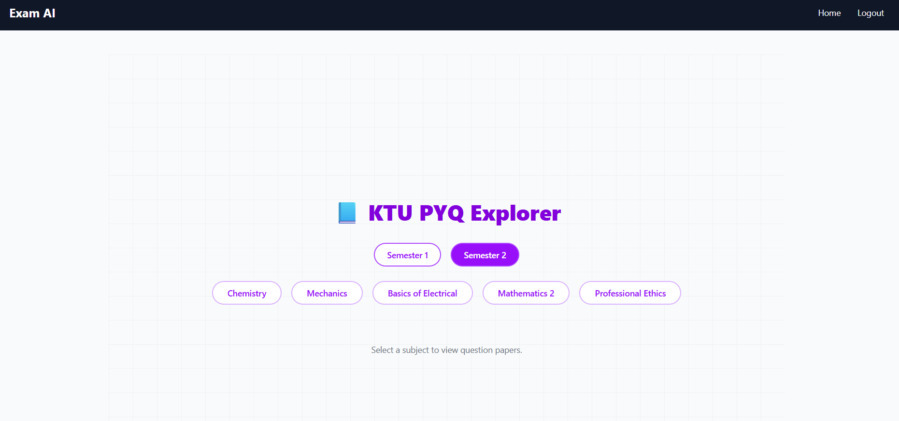

# CODERECET

## Project Repository
https://github.com/devananda6200/CODERECET-ByteWizards

### Team Name :
ByteWizards

### Team Members :
- Deva Nanda Nair  
- Swathi H Nair 
- Shreya R S 

### Project Description
**Project Padhik (പഥികൻ)** is a dual-purpose AI-powered student ecosystem designed specifically for the educational and employment challenges faced by students in Kerala. It consists of two integrated pillars:

1. **Academic Accelerator (EXAM AI Wing)** – helps students boost CGPA and ace university exams using AI-driven PYQ solving, smart note analysis, and curated YouTube learning playlists.
2. **Career Navigator (Original Padhik)** – analyzes resumes and GitHub profiles to identify skill gaps and suggests personalized learning paths and hyper-local job opportunities.

It empowers students from their **first semester to their first job**—making Padhik the ultimate Kerala student companion.

---

## Technical Details

### Technologies/Components Used

## For Software:

**Languages used:**
- Python  
- JavaScript  
- HTML/CSS  

**Frameworks used:**
- Flask (Backend)  
- Svelte + Astro + Tailwind CSS (Frontend)  

**Libraries used:**
- LangChain  
- Together.ai  
- Google Generative AI (Gemini)  
- PyMuPDF (fitz)  
- Chroma (Vector Store)  
- SymPy (Math solver)  
- dotenv  
- Flask-CORS  
- Requests  

**Tools used:**
- GitHub  
- VS Code  
- Postman  
- Gamma for Deck  
- Figma (UI mockups)  
- YouTube Data API  
- LinkedIn API (planned)

---

[List specifications]  
- Runs on any machine with Python 3.10+  
- Tested on Google Colab, local Ubuntu 22.04, and Windows 10  

[List tools required]  
- Python + pip  
- .env file for API keys  

---

## Implementation

## For Software:

### Installation
```bash
git clone https://github.com/devananda6200/CODERECET-ByteWizards
cd CODERECET-ByteWizards
python -m venv env
source env/bin/activate  # for Linux/macOS
# or
env\Scripts\activate  # for Windows

pip install -r requirements.txt
# Add your .env file with GEMINI_API_KEY and TOGETHER_API_KEY
python app.py
# Then open the frontend (Svelte project)
cd frontend
npm install
npm run dev
```

### Screenshots (Add at least 3)

  
*Main dashboard allowing users to choose between "Boost My Grades" (XMAI) or "Build My Career" (Navigator).*



  
*User uploads a PDF of previous year questions and receives step-by-step AI-generated solutions.*

  
   *Caption: Gemini AI analyzing resume + GitHub and generating skill gap and career roadmap.*

---

### Diagrams

#### Workflow (Architecture Diagram)

  


### Project Demo

### Video

[https://youtu.be/sample-demo-link](https://youtube.com/shorts/78PsVvvoW5Y?feature=share)  


## Team Contributions

**Deva Nanda Nair:**    
- Core backend logic and integration with Together AI
- Flask endpoints and Gemini integration

**Shreya R S:**  
- Career Navigator logic 
- EXAM AI  Wing Setup

**Swathi H Nair:**  
- Frontend design and implementation (Svelte, Astro, Tailwind)  
 


